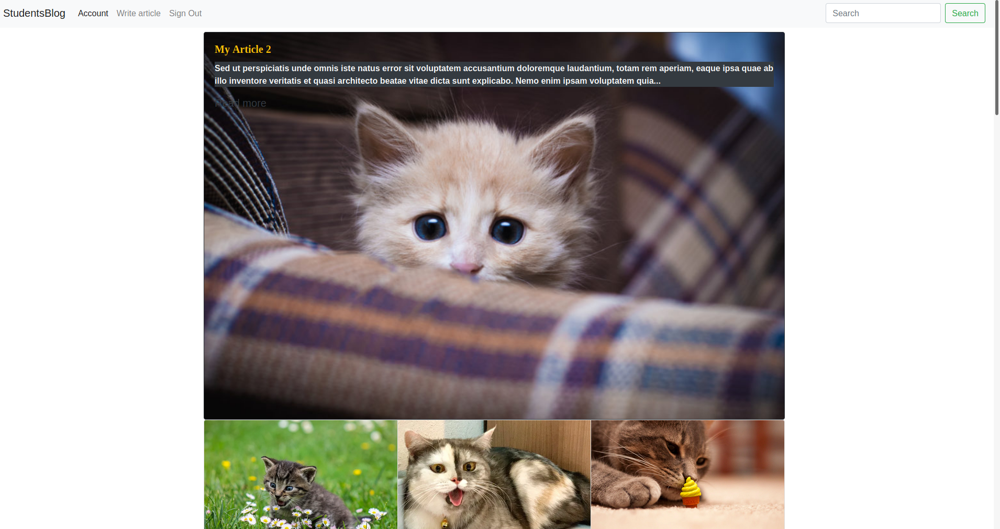
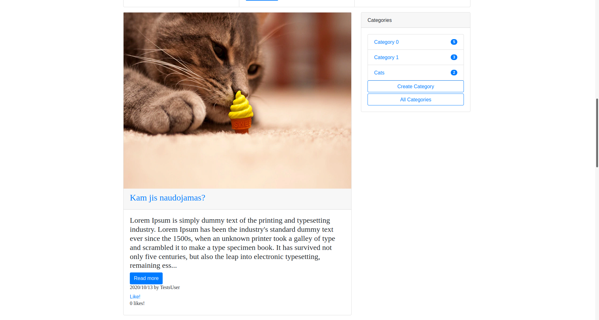

# Microverse Capstone Project - Blog app
Microverse Ruby on Rails capstone project. This project is a blogging app, where users can register, start writing their own articles, read articles written by others, and give likes to those articles.

## Project features

- Users can create accounts and login.
- When loged in, users can create articles, update or delete them.
- When loged in users can like articles.
- Featured article is showed at the top which is the most liked article.
- Two bottom featured images are picked last ones from two different categories.
- Data when an article created on who created it is showed on the article on the main page.
- When user clicks on specific category it sorts articles just by that category
- In categories right side field users can see how many articles each category has.


<br>
<br>

## Built With
- Ruby 2.7.0
- Ruby on Rails 6.0.3.4

## Video presentation of the project

Click the following [Video presentation link](https://www.loom.com/share/a6f4c7ca3b2a4acea1261b766476a7c9) to see Video presentation of the project.

## Live Demo

Click the following [link](https://blogaboutcats.herokuapp.com/) live version of the site.
To check website functionality you can use TestUser which is already created:
`email: test2@test.com`
`password: asdfasdf`

#### To get this project on your local machine, follow these steps:
1. To get this project up and running locally, you should have [Ruby](https://www.ruby-lang.org/en/) installed on your computer.

2. Run this command `git clone git@github.com:visva-dev/Students-Blog.git` in the desired folder to clone the repository on to your local machine.
After cloning the project, you should move into the directory where the project is stored, example `cd Students-Blog`.

3. Then run to following command install the necessary dependencies

```bash
    bundle install
```

4. Step 4

```bash
    rails db:create
```

5. Step 5

```bash
    rails db:migrate
```

6. Step 6 If you want to have demo content and test user already created, run this:

```bash
    rails db:seed 
```

7. Step 7

```bash
    Rails s
```

Sometimes you can be asked to check files with yarn, so run this command:

```bash
    yarn install --check files 
```
#### To run the tests, run:
```bash
    bundle exec rspec
```

## Authors

👤 **Visvaldas Rapalis**

- Github: [@visva-dev](https://github.com/visva-dev)
- Twitter: [@Visva_Dev](https://twitter.com/Visva_Dev)
- Linkedin: [@Visvaldas-Rapalis](https://www.linkedin.com/in/visvaldas-rapalis/)
- Website: [good-developer.com](https://good-developer.com)

## Show your support

Give a ⭐️ if you like this project!

## Acknowledgments

- This project was originally taken from [The Odin project](https://www.theodinproject.com/courses/ruby-on-rails/lessons/your-first-rails-application-ruby-on-rails).
- The project was inspired by the [Microverse](https://www.microverse.org/) program.

## 📝 License

This project is [MIT](lic.url) licensed.